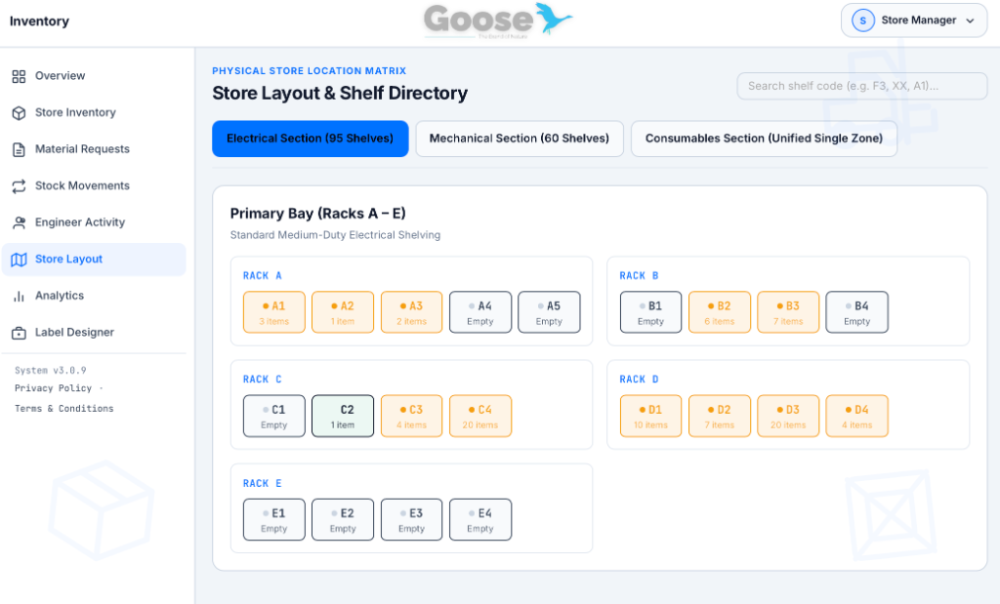
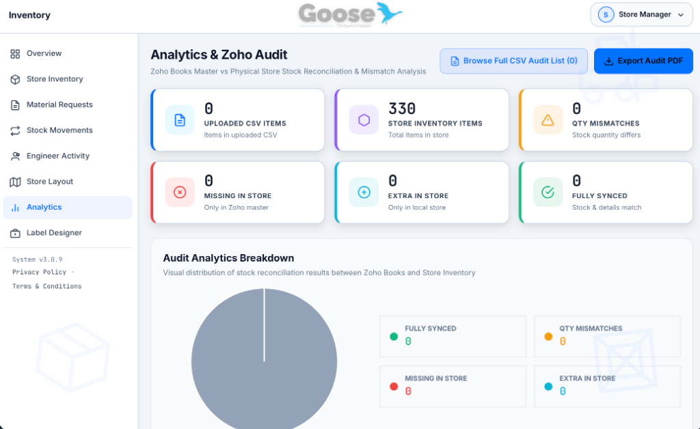
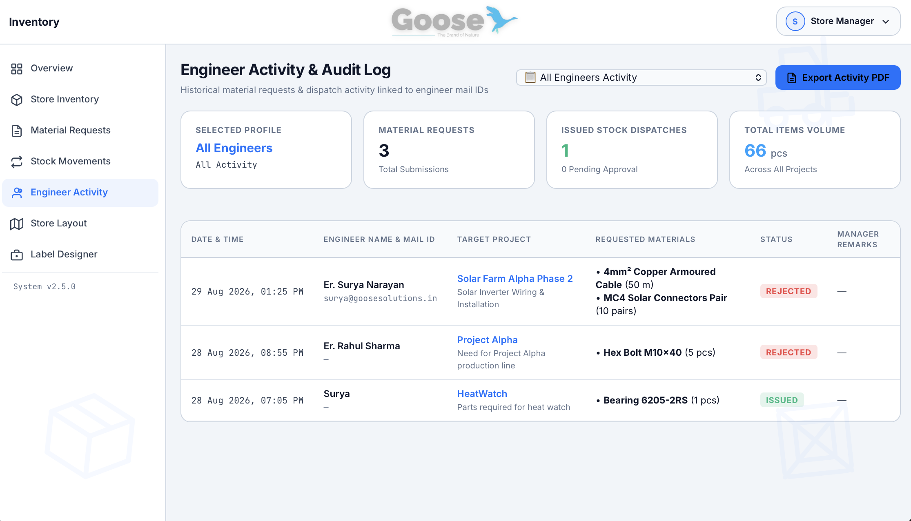
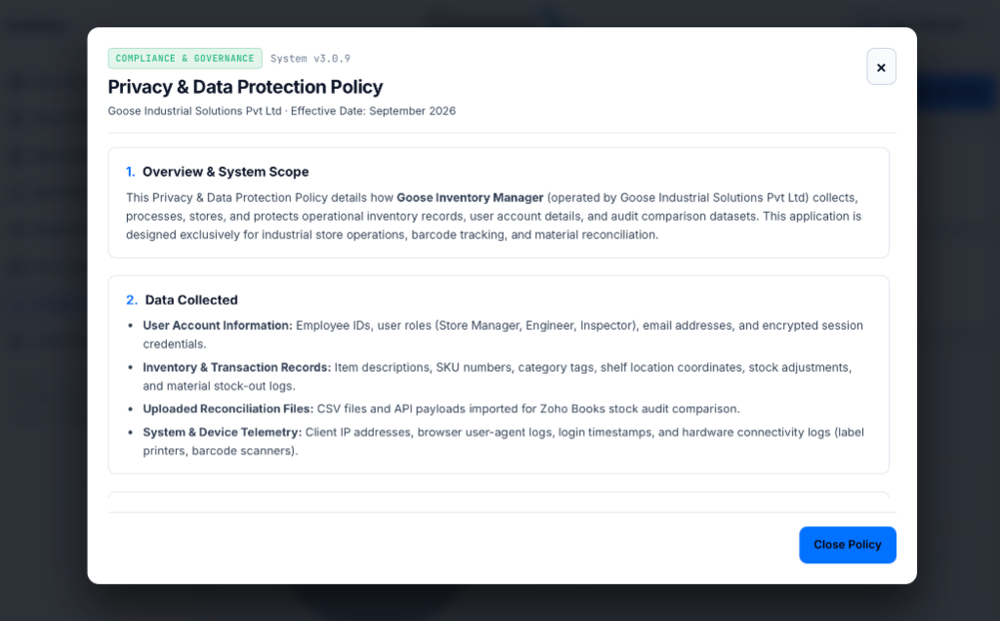
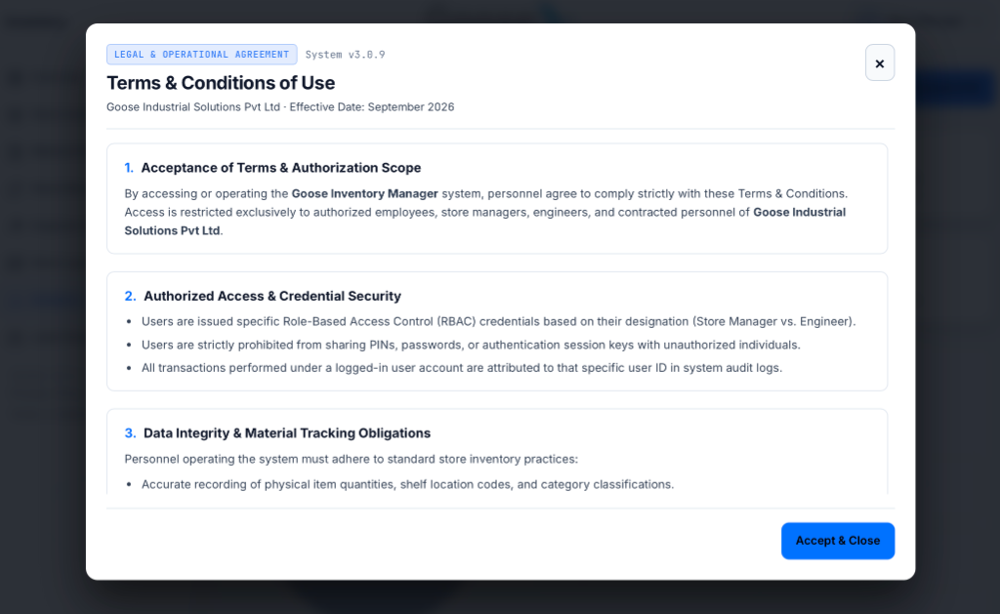
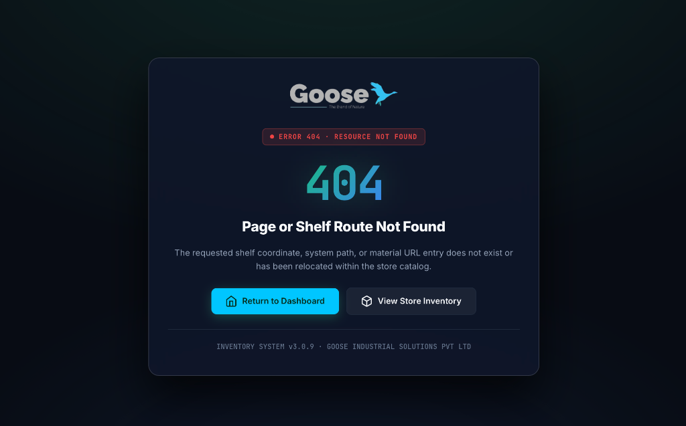
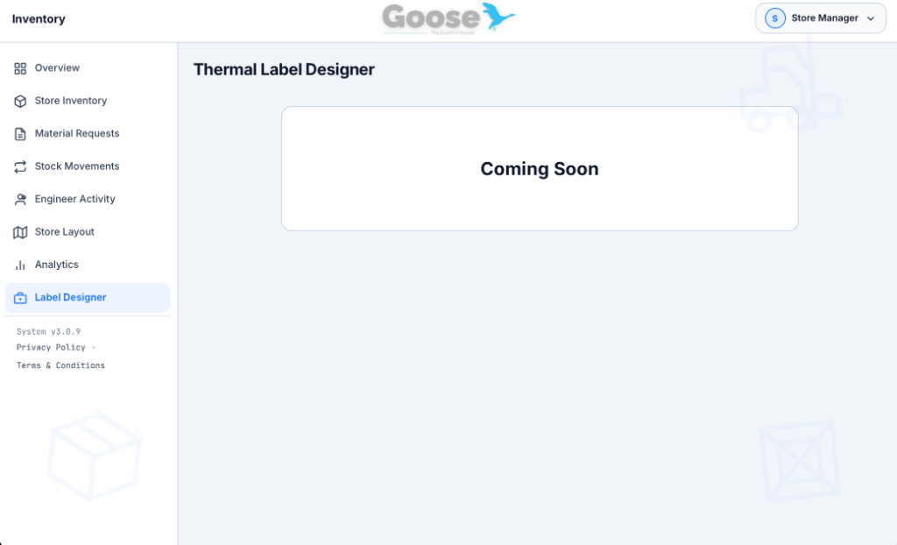

<div align="center">
  
  <h1>Goose Inventory Manager</h1>
  <p><strong>Industrial-Grade Store Inventory & Barcode Management System (v3.1.1)</strong></p>
  <p>Engineered for Mechanical, Electrical & Consumable Equipment Stores</p>
</div>

---

## Overview

**Goose Inventory Manager** is a high-density, industrial-grade store inventory management web application built for factory floors, industrial plants, and engineering equipment stores. It provides real-time material tracking, primary **Zoho Code** master SKU management, automatic stock deduplication & merging, HID barcode scanner integration (**Helett HT20**), 1-click **Tej C15** thermal barcode sticker printing, project/client material allocations, and live **Zoho Books API** synchronization.

---

## System Screenshots

| **Store Overview Dashboard** | **Material Directory & Inventory** |
| :---: | :---: |
| <sub>Real-time operational summary, low stock alerts &amp; quick management actions</sub><br><br><a href="pictures/overview.png"></a> | <sub>Search and filter materials by Zoho Code, zone, category &amp; shelf location</sub><br><br><a href="pictures/store_inventory.png"></a> |
| **Store Layout & Shelf Directory** | **Analytics & Zoho Audit Hub** |
| <sub>Visual rack matrix mapping Racks A-E, shelf codes &amp; zone counts</sub><br><br><a href="pictures/store_layout.png"></a> | <sub>Stock reconciliation, quantity mismatches &amp; fully synced item breakdown</sub><br><br><a href="pictures/analytics_hub.png"></a> |
| **Material Requests Workflow** | **Stock Movements Audit Log** |
| <sub>Review, approve, and track material requisition requests from site engineers</sub><br><br><a href="pictures/material_requests.png"></a> | <sub>Complete audit trail recording inward receipts and outward allocations</sub><br><br><a href="pictures/stock_movments.png"></a> |
| **Engineer Activity & Audit Log** | **Manager Options & Centralized Security** |
| <sub>Track historical requests linked to engineer emails with 1-click PDF export</sub><br><br><a href="pictures/engineer-ACT.png"></a> | <sub>Global credential settings, Dark/Light theme toggles &amp; live Zoho API sync</sub><br><br><a href="pictures/admin_options.png"></a> |
| **Privacy & Data Protection Policy** | **Terms & Conditions of Use** |
| <sub>Enterprise compliance modal detailing data processing &amp; RBAC access control</sub><br><br><a href="pictures/privacy_policy.png"></a> | <sub>Legal operational agreement governing store manager &amp; engineer system usage</sub><br><br><a href="pictures/terms_conditions.png"></a> |
| **Custom 404 Error Page** | **Thermal Label Designer Module** |
| <sub>Gradient-styled fallback page for non-existent material routes &amp; system paths</sub><br><br><a href="pictures/page_404.png"></a> | <sub>Custom barcode sticker template designer &amp; thermal print layout editor</sub><br><br><a href="pictures/label_designer.png"></a> |

---

## Key Features & System Capabilities

- **Unified Action Button System (38px Height Standard)**: All header action buttons across Store Overview, Inventory, Store Layout, Analytics, Stock Movements, and Engineer Activity views share identical `38px` height, `0.5rem 1rem` padding, font size, and flex alignment.
- **Redesigned Analytics KPI Cards**: Analytics & Zoho Audit tab features horizontal flex cards with themed icons, left border accents, and 3-column grid layout (`repeat(3, 1fr)`) matching the Store Overview tab.
- **Primary Zoho Code Identifier System**: Tracks materials using **Zoho Code** as the primary master SKU across search, directory, barcode stickers, PDF reports, and CSV exports.
- **Automatic Stock Deduplication & Auto-Merging Engine**: Adding or importing items sharing an existing non-placeholder Zoho Code automatically consolidates quantities into a single primary item entry.
- **Live Duplicate Warning & Submit Pop-up Modal**: Typing an existing Zoho Code displays an instant real-time amber warning banner with stock & shelf location details, followed by a confirmation pop-up modal requesting manager approval before merging.
- **SEO, OpenGraph & Cyan Goose Favicon**: Comprehensive SEO meta titles, meta descriptions, OpenGraph / Twitter social cards, cyan goose favicon logo, and dynamic browser tab titles on view navigation.
- **Sitemap.xml & Robots.txt Integration**: Standards-compliant `/sitemap.xml` and `/robots.txt` endpoints served with explicit MIME headers.
- **Custom 404 Page & Server Catch-All**: Custom `404.html` error page with gradient theme, home links, and Express server fallback.
- **Hardware Barcode Scanner Support**: Instant HID mode barcode scanning via **Helett HT20** (2.4G wireless USB dongle).
- **Tej C15 Thermal Barcode Sticker Printing**: Direct browser thermal sticker printing pre-formatted for **Tej C15 / YXWL Y50** label printers (50mm × 25mm labels) featuring scannable Code128 barcodes, QR codes, Zoho Code, and shelf location tags.
- **Centralized Password Security**: Store Manager password is managed centrally via `POST /api/auth/change-pin`. Changing the password on one device immediately updates access across all laptops, phones, and desktops globally.
- **Engineer Zoho Email 6-Digit OTP Auth**: Secure two-factor login workflow requiring Engineers to enter their Zoho/Company Email ID (`surya@goosesolutions.in`) and verify a 6-digit OTP sent via Zoho SMTP.
- **Offline LocalStorage Cache Resilience**: Client automatically caches inventory and requests in browser `localStorage`. If network connection drops, the app seamlessly falls back to offline cache mode without UI freezing.
- **Physical Store Layout & Shelf Directory**: Visual rack directory mapping Racks A through E, shelf codes (`E-G1`, `C4`, `T1 & T2`, `D1`, `D2`, etc.), shelf search, and zone tabs.
- **Engineer Activity & Audit History Log**: Dedicated activity dashboard tracking all material requests and stock dispatches linked to engineer email addresses.
- **1-Click CSV & PDF Report Exports**: Export complete store inventory catalog to UTF-8 Excel-compatible CSV spreadsheets or formatted A4 PDF summary reports (`jsPDF` + `jsPDF-AutoTable`).
- **Project, Client & Vendor Allocation**: Allocate outward stock to specific project names (e.g. *Project HeatWatch Phase 3*) and recipient engineers.
- **Zoho Books REST API Sync**: Direct 1-click integration with Zoho Books catalog for automatic item import and stock synchronization.

---

## Store Operational Workflow

```
1. Item Arrival
   └─▶ Material arrives at the store room.

2. Web Registration & Auto-Merge Guard
   └─▶ Manager registers material in web app → Checks Zoho Code.
   └─▶ If Zoho Code exists → Real-time alert triggers → Merges quantity into existing item.
   └─▶ If new item → Registers master catalog item with shelf location.

3. Tej C15 Thermal Label Printing
   └─▶ Click "Sticker" → Click "Print Sticker (Tej C15)" → Prints 50x25mm barcode label.

4. Label Application
   └─▶ Stick the printed barcode label onto the physical material item/box/bin.

5. Barcode Verification Scan
   └─▶ Scan label with Helett HT20 scanner → Displays "REGISTERED IN DATABASE" verification badge & specs.

6. Store Entry or Allocation
   └─▶ Option A: Receive into central store inventory (+ Stock IN).
   └─▶ Option B: Allocate & issue outward (- Stock OUT) to Project, Client, or Vendor.

7. Real-Time Sync & Audit Log
   └─▶ Transaction logged automatically in Stock Movements with recipient name and project details.
```

---

## Hardware Compatibility

| Hardware | Model | Connection | Function |
|---|---|---|---|
| **Barcode Scanner** | Helett HT20 | 2.4GHz USB Dongle (HID) | Instant barcode lookup & stock action trigger |
| **Label Printer** | Tej C15 / YXWL Y50 | Classic Bluetooth / Browser Print | Thermal sticker printing (50mm × 25mm Code128 + QR) |

---

## Getting Started

### Prerequisites
- **Node.js**: v18.0.0 or higher
- **npm**: v9.0.0 or higher

### Installation & Local Setup

1. **Clone the Repository**:
   ```bash
   git clone https://github.com/Soorya-Narayan/Goose-Inventory-Manager.git
   cd Goose-Inventory-Manager
   ```

2. **Install Dependencies**:
   ```bash
   npm install
   ```

3. **Start the Application**:
   ```bash
   npm start
   ```

4. **Environment Configuration (`.env`)**:
   Create a `.env` file in the root directory to enable Zoho Mail SMTP OTP email dispatching:
   ```env
   ZOHO_EMAIL=surya@goosesolutions.in
   ZOHO_PASSWORD=your_zoho_app_password
   ```

5. **Access the Web App**:
   Open your browser and navigate to `http://localhost:3000`
   - **Default Store Manager Password**: `Mannar@200`
   - **Engineer Login**: Requires valid Zoho/Company Email ID & 6-digit OTP

---

## API Endpoints Summary

| Endpoint | Method | Description |
|---|---|---|
| `/api/auth/login` | `POST` | Authenticate Store Manager (`Mannar@200`) or Engineer PIN |
| `/api/auth/change-pin` | `POST` | Update Store Manager password globally across all server clients |
| `/api/auth/pin` | `GET` | Retrieve current global Store Manager password status |
| `/api/auth/send-manager-reset-otp` | `POST` | Dispatch 6-digit password reset OTP to company admin email |
| `/api/auth/reset-manager-password` | `POST` | Authorize and reset Store Manager password via OTP code |
| `/api/auth/send-otp` | `POST` | Dispatch 6-digit verification OTP code to specified Zoho/company email |
| `/api/auth/verify-otp` | `POST` | Validate 6-digit OTP code and return authenticated engineer session profile |
| `/api/items` | `GET` | Retrieve complete inventory material catalog |
| `/api/items` | `POST` | Add a new material item with auto-merge duplicate Zoho Code handling |
| `/api/items/:id` | `PUT` / `DELETE` | Edit or delete a material item |
| `/api/items/:id/adjust-stock` | `POST` | Process stock inward/outward allocation with recipient info |
| `/api/requests` | `GET` / `POST` | Submit or retrieve material requests linked to engineer mail IDs |
| `/api/requests/:id` | `PUT` | Update request status (`pending`, `approved`, `issued`, `rejected`) |
| `/api/transactions` | `GET` / `DELETE` | Retrieve or clear stock movement audit logs |
| `/api/zoho/sync-live` | `POST` | Trigger live sync with Zoho Books REST API |

---

## License & Credits

Developed for **Goose Industrial Solutions Pvt Ltd**.  
Built with Node.js, Express, JavaScript, and Vanilla CSS.
