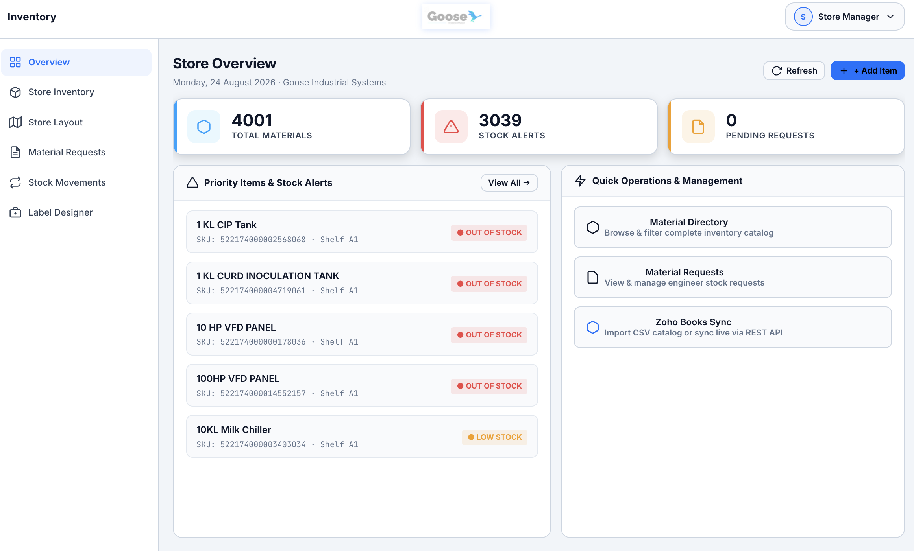
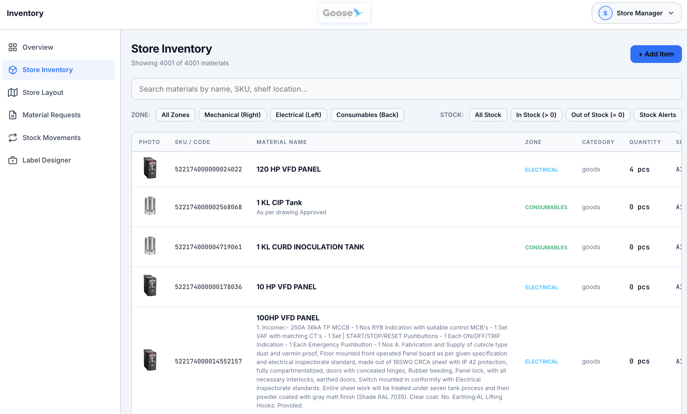
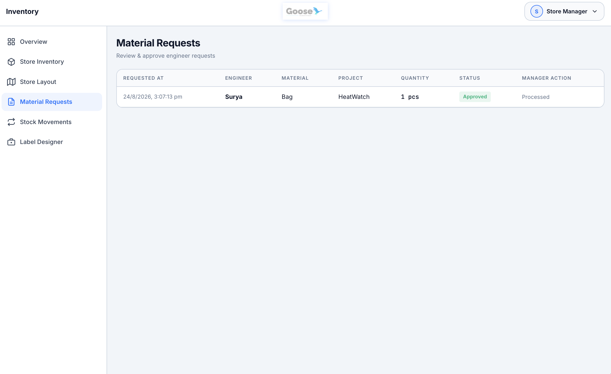
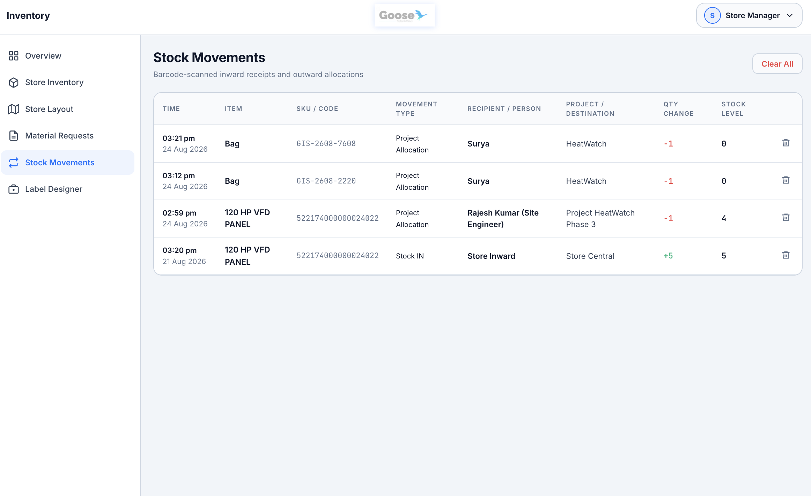
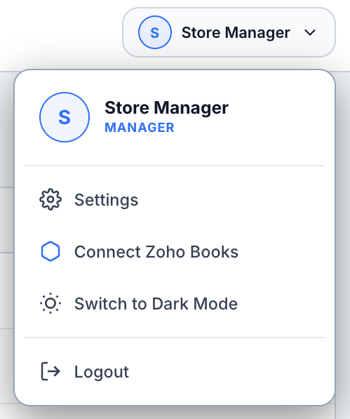

<div align="center">
  
  <h1>Goose Inventory Manager</h1>
  <p><strong>Industrial-Grade Store Inventory & Barcode Management System</strong></p>
  <p>Engineered for Mechanical, Electrical & Consumable Equipment Stores</p>
</div>

---

## 🏭 Overview

**Goose Inventory Manager** is a high-density, industrial-grade store inventory management web application built for factory floors, industrial plants, and engineering equipment stores. It provides real-time material tracking, HID barcode scanner integration (**Helett HT20**), 1-click FlashLabel Pro barcode printing workflow, project/client material allocations, and live **Zoho Books API** synchronization.

---

## 📸 System Screenshots

### 📊 Store Overview Dashboard
Real-time operational summary displaying total inventory count, low stock threshold alerts, priority items, and quick management actions.



---

### 📦 Material Directory & Inventory Management
Search and filter over 4,000+ industrial materials by zone (Mechanical, Electrical, Consumables), stock status, category, or shelf location.



---

### 📝 Material Requests Workflow
Review, approve, and track material requisition requests submitted by site engineers and project teams.



---

### 🔄 Stock Movements & Allocation Audit Log
Complete audit trail recording every inward receipt and outward allocation to specific engineers, projects, customers, or vendors.



---

### ⚙️ Store Manager Options Menu
Quick options menu for updating manager credentials, toggling Dark/Light themes, and triggering live Zoho Books API synchronization.



---

## 🛠️ Key Features

- **⚡ Hardware Barcode Scanner Support**: Instant HID mode barcode scanning via **Helett HT20** (2.4G wireless USB dongle).
- **🏷️ Auto-Generated Barcode IDs**: Auto-generates unique Product IDs (`GIS-YYMM-XXXX`) for new materials with 1-click copy for **FlashLabel Pro** label printing.
- **🔍 Live Database Verification**: Scanning a barcode instantly cross-checks the inventory database, displaying material specs, photo, zone, shelf location, rate, and recent logs.
- **🏗️ Project, Client & Vendor Allocation**: Allocate outward stock to specific project names (e.g. *Project HeatWatch Phase 3*) and recipient engineers (e.g. *Rajesh Kumar*).
- **📜 Complete Audit Log**: Real-time transaction logging for all stock movements with timestamped recipient notes and delta history.
- **💼 Zoho Books REST API Sync**: Direct 1-click integration with Zoho Books catalog for automatic item import and stock synchronization.
- **🎨 Industrial Design System**: High-density UI built with Vanilla CSS, dark/light mode toggle, and modern typography tailored for industrial environments.

---

## 🔄 Store Operational Workflow

```
1. Item Arrival
   └─▶ Material arrives at the store room.

2. Web Registration
   └─▶ Manager registers material in web app → Auto-generates unique ID (GIS-2608-4721).

3. FlashLabel Pro Print
   └─▶ Click "Copy ID" → Paste into FlashLabel Pro → Print 50x30mm sticker on Tej C15 printer.

4. Label Application
   └─▶ Stick the printed barcode label onto the physical material item/box.

5. Barcode Verification Scan
   └─▶ Scan label with Helett HT20 scanner → Displays "REGISTERED IN DATABASE" verification badge & specs.

6. Store Entry or Allocation
   └─▶ Option A: Receive into central store inventory (+ Stock IN).
   └─▶ Option B: Allocate & issue outward (- Stock OUT) to Project, Client, or Vendor.

7. Real-Time Sync & Audit
   └─▶ Transaction logged automatically in Stock Movements with recipient name and project details.
```

---

## 🔌 Hardware Compatibility

| Hardware | Model | Connection | Function |
|---|---|---|---|
| **Barcode Scanner** | Helett HT20 | 2.4GHz USB Dongle (HID) | Instant barcode lookup & stock action trigger |
| **Label Printer** | Tej C15 / YXWL Y50 | USB / FlashLabel Pro App | Thermal sticker printing (50mm × 30mm Code128) |

---

## 🚀 Getting Started

### Prerequisites
- **Node.js**: v18.0.0 or higher
- **npm**: v9.0.0 or higher

### Installation & Local Setup

1. **Clone the Repository**:
   ```bash
   git clone https://github.com/Soorya-Narayan/Goose-Inventory-Manager.git
   cd Goose-Inventory-Manager
   ```

2. **Install Dependencies**:
   ```bash
   npm install
   ```

3. **Start the Application**:
   ```bash
   npm start
   ```

4. **Access the Web App**:
   Open your browser and navigate to `http://localhost:3000`
   - **Default Store Manager PIN**: `1234`

---

## 📡 API Endpoints Summary

| Endpoint | Method | Description |
|---|---|---|
| `/api/items` | `GET` | Retrieve complete inventory material catalog |
| `/api/items` | `POST` | Add a new material item with auto-generated SKU |
| `/api/items/:id` | `PUT` / `DELETE` | Edit or delete a material item |
| `/api/items/:id/adjust-stock` | `POST` | Process stock inward/outward allocation with recipient info |
| `/api/transactions` | `GET` / `DELETE` | Retrieve or clear stock movement audit logs |
| `/api/zoho/sync-live` | `POST` | Trigger live sync with Zoho Books REST API |

---

## 📄 License & Credits

Developed for **Goose Industrial Systems**.  
Built with Node.js, Express, JavaScript, and Vanilla CSS.
